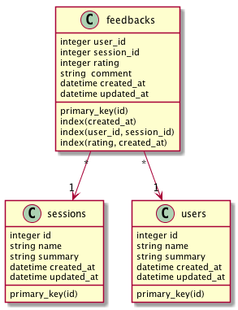

# Session Feedback Service

## Dependencies

* Ruby 2.2
This project has been created using ruby 2.2.x You can download it using a package manager or the recommenced [rvm](https://rvm.io/)

Once ruby is installed, you will need to run `gem install bundler` and then `bundle install`. This will install all the project dependencies listed in the Gemfile, including rails

You can test your installation
```
ruby -v
rails -v
```
## Database initialization and seed
I am using SQLite, therefore you don't need to install and configure any database.

First you need to run a rake command to create the database and the tables
```
rake db:migrate
```
This will create a development.sqlite3 and 3 tables (users, feedbacks, sessions). to create also the tables on the test environment you need to specify the environment ```rake db:migrate RAILS_ENV=test```.

Currently, there are no endpoints to create users and sessions. We provide a script to populate the database with 20 users and 20 sessions. Their unique identifiers (id) range from 1 to 20 *in both tables*. Also, the script creates a random comment of user *x* to session *x*, where *x* is an id value (user *1* has feedback on session *1*, user *2* has feedback on session *2*, and so on). After the script is run, you therefore have 20 users, 20 sessions and 20 feedbacks.
```
rake db:seed
```
### Database structure

The migrations will create 3 tables as shown in the diagram<br />


The table feedbacks contains 2 indexes, one composite index on user_id and session_id and one unique index for created_at.

## How to run the tests

For test I am using [Rspec](http://rspec.info/). All the unit tests are located in the spec folder on the root of the project matching project structure (models, controllers). You can run all tests with the following command.
```
rspec .
```

## Running the application
running the following command will start the server listening on port 3000 by default
```
rails s
```

## Api specification

There are two routes defined and you can see them with the following command `rake routes`
* url
  ```
  /sessions/:session_id/feedbacks
  ```
* method
  ```
  POST
  ```
* header params<br />
  **required:**
  ```
  Ubi-UserId=[integer]
  ```
* data params
  ```json
  {
    "rating": 4,
    "comment": "sample comment"
  }
  ```
* Success response<br />
  **HTTP status code**: `200`
  ```json
  {
      "data": {
          "id": "17",
          "type": "feedbacks",
          "attributes": {
              "rating": 4,
              "comment": "sample comment",
              "created-at": "2017-08-19T20:56:24.738Z",
              "updated-at": "2017-08-19T20:56:24.738Z"
          },
          "relationships": {
              "user": {
                  "data": {
                      "id": "7",
                      "type": "users"
                  }
              },
              "session": {
                  "data": {
                      "id": "15",
                      "type": "sessions"
                  }
              }
          }
      }
  }
  ```
* Error response<br />
  **HTTP status code**: `422`
  ```json
  {
      "errors": [
          {
              "status": "422",
              "source": null,
              "title": "validation failed",
              "detail": "Validation failed: User can just leave one feeback per session"
          }
      ]
  }
  ```
OR<br />
  **HTTP status code**: `404`
  ```json
  {
      "errors": [
          {
              "status": "404",
              "source": null,
              "title": "not found",
              "detail": "Couldn't find User with 'id'=98" or "detail": "Couldn't find Session with 'id'=98"
          }
      ]
  }
  ```

* url
  ```
  /feedbacks
  ```
* method
  ```
  GET
  ```
* Url params<br />
  **Optional:**
  ```
  rating=[a comma separated list of integers]
  ```
  **Example**
  ```
  /feedbacks
  /feedbacks/rating=1
  /feedbacks/rating=1,2
  ```
* Success response<br />
  **HTTP status code**: `200`
  ```json
  {
      "data": [
          {
              "id": "17",
              "type": "feedbacks",
              "attributes": {
                  "rating": 4,
                  "comment": "sample comment",
                  "created-at": "2017-08-19T20:56:24.738Z",
                  "updated-at": "2017-08-19T20:56:24.738Z"
              },
              "relationships": {
                  "user": {
                      "data": {
                          "id": "7",
                          "type": "users"
                      }
                  },
                  "session": {
                      "data": {
                          "id": "15",
                          "type": "sessions"
                      }
                  }
              }
          },
          ...
      ]
  }
  ```
